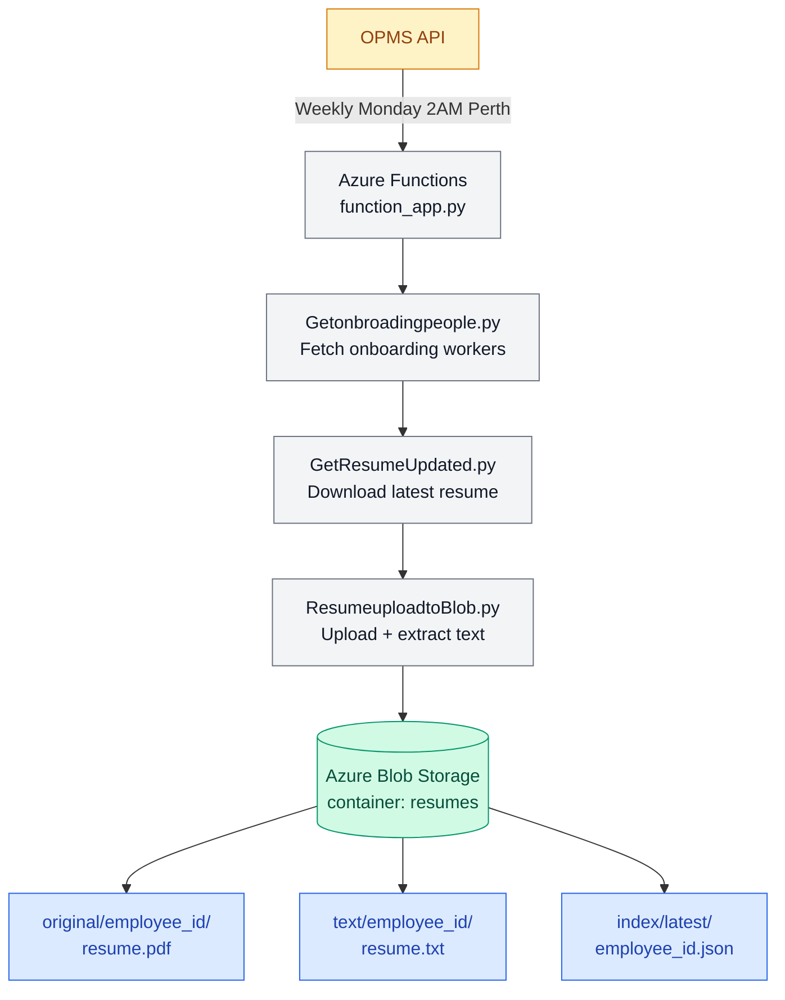

# Resume Updated Weekly Automation

Automated resume synchronization system for OPMS onboarding workers.

## System Architecture



## What this project does

- Retrieves onboarding workers from OPMS every Monday 2:00 AM Perth time
- Downloads their latest resume documents via OPMS API
- Uploads PDFs to Azure Blob Storage under `original/`
- Extracts text content from PDF/DOCX and stores under `text/`
- Updates the employee index under `index/latest/`

## Features

Weekly Automated Resume Sync — Every Monday 2:00 AM Perth Time:

1. Load onboarding workers from OPMS
2. Search OPMS training records and competency data
3. Download latest resume files per employee
4. Upload files to Azure Blob Storage
5. Extract text content from PDF/DOCX
6. Update index cache automatically

## Technologies

- Python 3.11
- Azure Functions (timer trigger)
- Azure Blob Storage
- OPMS API
- PyMuPDF
- python-docx
- GitHub

```
## Project Structure
Resume_updated_weekly/
├── function_app.py         Azure Function entry point
├── GetResumeUpdated.py     Download latest resume from OPMS
├── Getonbroadingpeople.py  Fetch onboarding worker list
├── Getconpetency.py        Fetch competency and ticket records
├── ResumeuploadtoBlob.py   Upload PDF and extract text to Blob
├── requirements.txt
├── host.json
└── .funcignore
```

```
## Blob Storage Structure
resumes/
├── original/{employee_id}/resume_{employee_id}{document_id}.pdf
├── text/{employee_id}/resume{employee_id}_{document_id}.txt
└── index/latest/{employee_id}.json
```

## Environment Variables

| Variable | Description |
|---|---|
| OPMS_CLIENT_ID | OPMS API client ID |
| OPMS_CLIENT_SECRET | OPMS API client secret |
| AZURE_STORAGE_CONNECTION_STRING | Azure Blob Storage connection string |
| AZURE_BLOB_CONTAINER | Blob container name (default: resumes) |

## Related

Resume Search Portal - Flask app that searches and AI-screens the resumes stored by this pipeline using keyword filtering, Deepseek pre-screening, and GPT-4o mini deep analysis.
